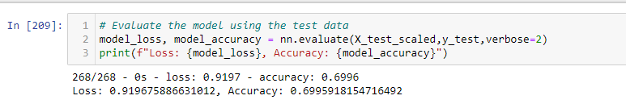

# Neural Network Charity Analysis

Columbia Data Science Module 19

## Overview
Using data from a foundation on loans they had given to various charity groups, I trained a neural network to predict the likelihood of a given loan leading to a successful outcome.

### Resources
Software/languages: Jupyter Notebook, Python
Python packages: SKLearn, Pandas, Tensorflow

[Data:](https://github.com/perryabdulkadir/Neural_Network_Charity_Analysis/blob/main/Resources/charity_data.csv) charity_data.csv 

## Analaysis 

### Data Preprocessing

* **Target variable**

The target variable is straighforward, as the foundation has already gone through and evaluated each loan as being either successful or unsuccesful. The target variable is IS_SUCCESSFUL, where 1 is "yes" and 0 is "no."

* **Features**

I used the following features: APPLICATION_TYPE, AFFILIATION, CLASSIFICATION, USE_CASE, ORGANIZATION, STATUS, INCOME_AMT, SPECIAL_CONSIDERATIONS, and ASK_AMT.

* **Columns to drop**
I dropped EIN and NAME as they are arbitrary markers and not relevant to the outcome being measured.

```
application_df = application_df.drop(columns = ['EIN', 'NAME'])
application_df
```

I then proceeded to the binning process. 


## Results

### Compiling, Training, and Evaluating the Model

* **How many neurons, layers, and activation functions did you select for your neural network model, and why?**
I used 2 layers initially to prevent overfitting. I also kept the initial number of neurons low for the same reason, at 80 for the first hidden layer and 30 for the second. I used the Relu function because it is the most commonly used, so I thought it would make a good baseline. 

* **Were you able to achieve the target model performance?**
Initially, model accuracy was below the .75 threshold, at .69. 


* **Were you able to achieve the target model performance?**
No - I tried 5 different ways to increase model performance. First, I dropped STATUS and SPECIAL_CONSIDERATIONS because both of these features were overwhelmingly skewed toward one response. I ran the model again with both dropped, just STATUS dropped, and just SPECIAL_CONSIDERATiONS dropped. In each case, model performance suffered compared to my original model. I then increased the number of neurons, but performance again suffered. I added one more hidden layer, but performance did not improve. Finally, I tried running the model again with tanh, leakRelu, and sigmoid activation functions, all with no improvement over the original or a loss of accuracy. 

## Summary
Overall, I was able to achieve fair model performance, but I believe a better model could be constructed. Going forward, I would suggest using a supervised classification machine learning model to see if it could produce a higher accuracy result. I believe this is well-suited for such a model because the target variable is so straightforward.
